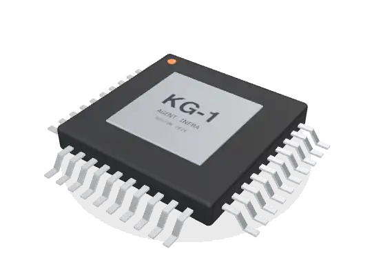
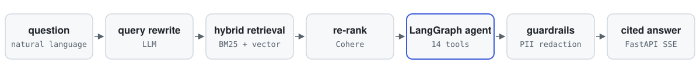
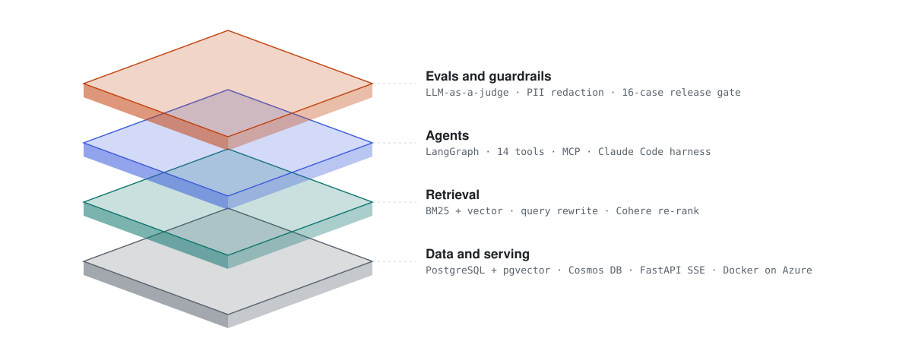
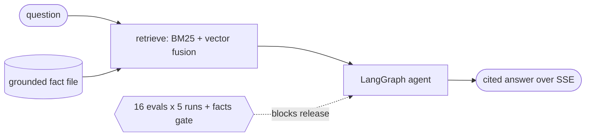
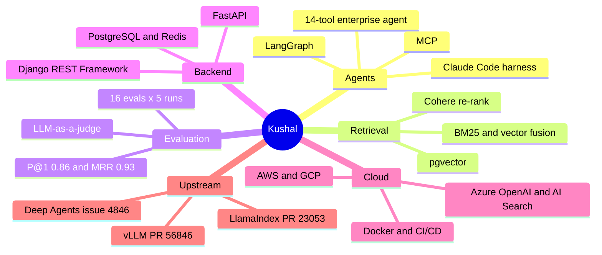

<!-- Every fact on this page is also plain text: images are decoration for people, text is what search and sourcing tools index. -->
<!-- Sources: resume V19, Crossref DOIs, Credly badges, GitHub API. Self-hosted assets, no trackers. The chip is a procedural Three.js model rendered to WebP. -->

<picture>
  <source media="(prefers-color-scheme: dark)" srcset="assets/banner-dark.svg">
  <source media="(prefers-color-scheme: light)" srcset="assets/banner-light.svg">
  
</picture>

  

  
  
  
  
  

**I build multi-agent systems and the retrieval that keeps them honest.**
AI Engineer at **Boston University's Questrom Computational Lab** and Lead Backend Engineer at the **Questrom Center for Action Learning**. M.S. in Computer Science, graduating December 2026. **NVIDIA-Certified Professional: Agentic AI** and **Claude Certified Developer**. First author on an IEEE paper in automated program repair. Available January 2027 (F-1 OPT, STEM OPT eligible).

<a href="#features-and-characteristics">features</a> · <a href="#experience">experience</a> · <a href="#open-source">open source</a> · <a href="#selected-work">selected work</a> · <a href="#publications">publications</a> · <a href="#certifications">certifications</a> · <a href="#stack">stack</a> · <a href="#where-this-breaks">where this breaks</a> · <a href="#contact">contact</a>

<picture>
  <source media="(prefers-color-scheme: dark)" srcset="assets/divider-dark.svg">
  <source media="(prefers-color-scheme: light)" srcset="assets/divider-light.svg">
  
</picture>

## Features and characteristics

**Features**
- **Agents in production:** a 14-tool LangGraph agent on Azure OpenAI for the enterprise client Sikich.
- **Measured retrieval:** hybrid BM25 + vector search with Cohere re-ranking; precision@1 0.86, MRR 0.93.
- **Evals as a release gate:** 16 agent evals run 5 times before every portfolio release.
- **Agent infrastructure:** a Claude Code harness with least-privilege permissions, context-routing hooks, and CodeRabbit review linked to Linear through MCP.
- **Guardrails:** PII and entity redaction before retrieval; cited answers streamed over FastAPI SSE.
- **Upstream:** open PRs to vLLM and LlamaIndex; a Deep Agents bug fixed by a maintainer from my report.

**Add-ons:** NVIDIA-Certified Professional: Agentic AI · Claude Certified Developer

 

<picture>
  <source media="(prefers-color-scheme: dark)" srcset="assets/metrics-dark.svg">
  <source media="(prefers-color-scheme: light)" srcset="assets/metrics-light.svg">
  
</picture>

| Characteristic | Test condition | Check it |
|---|---|---|
| **0.86** precision@1, **0.93** MRR | portfolio retrieval agent, 35 scored queries | [kushal-portfolio-v2](https://github.com/Kushal9889/kushal-portfolio-v2) |
| **1.16 s** median latency | live agent answers streamed over SSE | [live agent](https://kushal-portfolio-223.netlify.app) |
| **16 evals x 5 runs** | eval suite that gates every portfolio release | `npm run test:evals` in the repo |
| **14** tools | LangGraph agent for the enterprise client Sikich | work, private repository |
| **91.4%** vs 88.2% | transformer + GNN vs transformer alone | [IEEE paper](https://doi.org/10.1109/ICAICCIT64383.2024.10912101) |

<picture>
  <source media="(prefers-color-scheme: dark)" srcset="assets/divider-dark.svg">
  <source media="(prefers-color-scheme: light)" srcset="assets/divider-light.svg">
  
</picture>

## Experience

<picture>
  <source media="(prefers-color-scheme: dark)" srcset="assets/timeline-dark.svg">
  <source media="(prefers-color-scheme: light)" srcset="assets/timeline-light.svg">
  
</picture>

**Boston University, Questrom Center for Action Learning** · Lead Backend Engineer, August 2026 to present
An agentic SDLC harness that holds Claude Code agents to the same gates as human engineers in a regulated client codebase: least-privilege permissions, context-routing hooks, CodeRabbit review linked to Linear through MCP, shipped as a plugin. A Django REST Framework and PostgreSQL backend with data-layer RBAC, revocable JWT, audit logs and an idempotent recurrence engine; CI fails when the API contract drifts from the React frontend.

**Boston University, Questrom Computational Lab** · AI Engineer, Graduate Researcher, May 2026 to present
A production agentic RAG platform on Azure for the enterprise consulting client Sikich, owned from ingestion through deployment: a LangGraph agent exposing **14 tools** for document question answering, comparison and template-driven generation. Hybrid retrieval with LLM query rewriting and Cohere re-ranking, LLM-as-a-Judge evaluation for hallucination rate, PII redaction guardrails, and a Cosmos DB Gremlin knowledge graph. Customer-facing requirements, demos and weekly knowledge transfer.

<picture>
  <source media="(prefers-color-scheme: dark)" srcset="assets/architecture-dark.svg">
  <source media="(prefers-color-scheme: light)" srcset="assets/architecture-light.svg">
  
</picture>

**Boston University** · Graduate Teaching Assistant, MET CS 664 Artificial Intelligence (about 40 graduate students), September 2026 to present

**IMG Systems Pvt. Ltd.** · Software Engineering Intern, Remote, August 2024 to April 2025
Extended a Python document-parsing pipeline on Apache Tika, raising extraction accuracy **20%** across more than **5,000** candidate profiles a month and cutting recruiter screening time **15%**. Pydantic structured-output validation against a JSON Schema reached **95% schema accuracy**. Containerised services on PostgreSQL and Redis with Docker trimmed REST latency **25%**.

**Growaza Pvt. Ltd.** · Associate Software Engineer Intern, Remote, January to July 2024
Cut API response time **30%** with in-memory caching and asynchronous request handling, lifting engagement **22%** for more than **1,000** daily active users. MySQL inventory dashboard tracking **2,000+** SKUs. JWT and role-based access control on AWS EC2 and S3.

<picture>
  <source media="(prefers-color-scheme: dark)" srcset="assets/divider-dark.svg">
  <source media="(prefers-color-scheme: light)" srcset="assets/divider-light.svg">
  
</picture>

## Open source

Status and star counts below are rewritten weekly from the GitHub API by [a workflow in this repository](.github/scripts/refresh.py), so a merge shows up here without anyone editing the page.

<!--START_OSS-->
| Project | Contribution | Status | Stars |
|---|---|---|---|
| [vLLM](https://github.com/vllm-project/vllm) | PR [#56846](https://github.com/vllm-project/vllm/pull/56846): pythonic tool parsers agree across streaming and non-streaming modes, from my report [#56840](https://github.com/vllm-project/vllm/issues/56840) | **PR, under review**  | **92.7k** ★ |
| [LlamaIndex](https://github.com/run-llama/llama_index) | PR [#23053](https://github.com/run-llama/llama_index/pull/23053): run-level `max_iterations` and `early_stopping_method` apply on a reused Context, from my report [#23051](https://github.com/run-llama/llama_index/issues/23051) | **PR, under review**  | **52.3k** ★ |
| [LangChain Deep Agents](https://github.com/langchain-ai/deepagents) | issue [#4846](https://github.com/langchain-ai/deepagents/issues/4846): `CompositeBackend.ls("/")` swallowed default-backend errors; reproduction filed; maintainer fix [#4925](https://github.com/langchain-ai/deepagents/pull/4925) credits my report | **issue, fixed**  | **29.8k** ★ |
| [MCP Python SDK](https://github.com/modelcontextprotocol/python-sdk) | issue [#3490](https://github.com/modelcontextprotocol/python-sdk/issues/3490): a rejected `connect_to_server` leaves its transport running | **issue, open**  | **24.4k** ★ |
<!--END_OSS-->

**Reported** [langchain-ai/deepagents#4846](https://github.com/langchain-ai/deepagents/issues/4846): `CompositeBackend.ls("/")` aggregated results at the root and discarded errors from the default backend, so a caller whose backend had failed saw a healthy but nearly empty filesystem. Filed with a reproduction and a proposed fix mirroring the existing `grep` root-merge check. A LangChain maintainer authored and merged the fix in [#4925](https://github.com/langchain-ai/deepagents/pull/4925) three days later, crediting the report by name.

> [!NOTE]
> I did not write the patch. `deepagents` restricts merges to organisation contributors. What the report demonstrates is the part that transfers: reading an unfamiliar production SDK closely enough to find where it contradicts its own documented invariant, and writing it up precisely enough that someone senior acted without needing to ask a question.

<b>recently</b>: my newest issues and pull requests in open-source projects with 1,000+ stars, with live star counts, refreshed weekly

<!--START_ACTIVITY-->
- [run-llama/llama_index#23053](https://github.com/run-llama/llama_index/pull/23053) · 52.3k stars, PR, under review: fix(core): apply run-level max_iterations and early_stopping_method on a reused Context
- [vllm-project/vllm#56846](https://github.com/vllm-project/vllm/pull/56846) · 92.7k stars, PR, under review: [Bugfix][Tool Parser] Make pythonic tool parsers agree across streaming modes
- [qdrant/qdrant#10640](https://github.com/qdrant/qdrant/issues/10640) · 34.8k stars, issue, open: Fusion inside a prefetch is computed per shard, so its scores and score_threshold depend on shard_number
- [vllm-project/vllm#56840](https://github.com/vllm-project/vllm/issues/56840) · 92.7k stars, issue, open: [Bug]: pythonic / llama4_pythonic tool parsers return a tool call when streaming but raw text when not (trailing prose, leading-underscore names)
- [run-llama/llama_index#23051](https://github.com/run-llama/llama_index/issues/23051) · 52.3k stars, issue, open: [Bug]: max_iterations and early_stopping_method passed to .run() are ignored when the Context is reused
- [modelcontextprotocol/python-sdk#3490](https://github.com/modelcontextprotocol/python-sdk/issues/3490) · 24.4k stars, issue, open: ClientSessionGroup: a rejected connect_to_server leaves its transport running, the session is established before its components are validated
<!--END_ACTIVITY-->

<picture>
  <source media="(prefers-color-scheme: dark)" srcset="assets/divider-dark.svg">
  <source media="(prefers-color-scheme: light)" srcset="assets/divider-light.svg">
  
</picture>

## Selected work

<picture>
  <source media="(prefers-color-scheme: dark)" srcset="assets/stack3d-dark.svg">
  <source media="(prefers-color-scheme: light)" srcset="assets/stack3d-light.svg">
  
</picture>

**[BU Life AI](https://bulife-ai.netlify.app)** · [source](https://github.com/Kushal9889/BU-Life-AI)
A campus assistant for Boston University students, live with real traffic. A LangGraph supervisor classifies intent and routes to one of **3 specialised ReAct agents**, each owning its own thread so concurrent users never share state. Retrieval fuses BM25 with **NV-Embed 1024-dimension** vectors over pgvector through an EnsembleRetriever. That routing decision is what cut **redundant LLM calls by 70%**.

The trade-off worth asking about: orchestration complexity bought state isolation. One agent with a long prompt was simpler and mixed tool namespaces across housing, dining, and events until retrieval started contaminating.

**[Contextual bug detection](https://github.com/Kushal9889/Deep-Learning-for-Contextual-Bug-Detection-and-Automated-Fixes-in-Software-Systems)** · IEEE ICAICCIT 2024, first author
A transformer reads tokens and syntax; a graph network reads module dependencies; the two are concatenated and scored together. The combined model reached **91.4% accuracy** against 88.2% for the transformer alone. The graph branch scores lowest on its own at 85.7%, which is the point: structure without content cannot tell a correct function from a broken one.

**[Agentic portfolio](https://kushal-portfolio-223.netlify.app)** · [source](https://github.com/Kushal9889/kushal-portfolio-v2)
A LangGraph agent that answers questions about my work from a grounded fact file: BM25 fused with vector retrieval, answers streamed over SSE, **precision@1 0.86, MRR 0.93, 1.16 s median**. A facts gate fails the build when a corrected fact reappears, and 16 agent evals run 5 times before a release. Providers fail over in order, so an unset key degrades instead of erroring.

<picture>
  <source media="(prefers-color-scheme: dark)" srcset="assets/divider-dark.svg">
  <source media="(prefers-color-scheme: light)" srcset="assets/divider-light.svg">
  
</picture>

## Publications

**Deep Learning for Contextual Bug Detection and Automated Fixes in Software Systems**
ICAICCIT 2024, IEEE, pp. 624-629. First author. Transformer plus GNN: **91.4% accuracy** vs 88.2% for the transformer alone.
 [IEEE Xplore](https://ieeexplore.ieee.org/document/10912101) · [repository](https://github.com/Kushal9889/Deep-Learning-for-Contextual-Bug-Detection-and-Automated-Fixes-in-Software-Systems)

**Cyber-Physical Systems and the Future of Urban Living**
IGI Global, 2024. Co-author.
 [repository](https://github.com/Kushal9889/Cyber-Physical-Systems-and-the-Future-of-Urban-Living-Decision-Making-Challenges-and-Opportunities)

Both repositories carry a `CITATION.cff`, so GitHub's **Cite this repository** button returns the correct BibTeX rather than a citation for the code.

<picture>
  <source media="(prefers-color-scheme: dark)" srcset="assets/divider-dark.svg">
  <source media="(prefers-color-scheme: light)" srcset="assets/divider-light.svg">
  
</picture>

## Certifications

**NVIDIA-Certified Professional: Agentic AI** (NCP-AAI, 2026) is a proctored vendor exam, verifiable on Credly. So is **Claude Certified Developer - Foundations** (Anthropic, 2026). Plus AWS Cloud Technical Essentials (2026), Google Cloud Fundamentals (2025), and three completed courses of IBM's RAG and Agentic AI programme, each individually verifiable.

<picture>
  <source media="(prefers-color-scheme: dark)" srcset="assets/divider-dark.svg">
  <source media="(prefers-color-scheme: light)" srcset="assets/divider-light.svg">
  
</picture>

## Stack

| Area | Tools |
|---|---|
| Languages | Python, TypeScript, SQL |
| AI and LLM | LLM agents, Claude Code, RAG, LangGraph, LangChain, LLM-as-a-judge evals, hybrid search, re-ranking, tool calling, prompt engineering, guardrails, MCP (Model Context Protocol), LlamaIndex, NVIDIA NIM |
| Backend and data | FastAPI, Django REST Framework, PostgreSQL, pgvector, Redis, Cosmos DB, MySQL, React, Next.js |
| Cloud and DevOps | Azure (OpenAI, AI Search, Blob), Amazon Web Services (EC2, S3), GCP, Docker, CI/CD |

<picture>
  <source media="(prefers-color-scheme: dark)" srcset="assets/divider-dark.svg">
  <source media="(prefers-color-scheme: light)" srcset="assets/divider-light.svg">
  
</picture>

## Where this breaks

Written because a profile that only lists strengths is not worth reading, and because these are the questions an interviewer asks anyway.

<b>BU Life AI does not survive its own success.</b>

It runs on a Render free tier. The first thing to fail under load is CPU throttling and cold starts, then Neon connection limits. The fix is a paid tier with persistent workers and PgBouncer pooling. I have not needed it and have not pretended otherwise.

<b>The paper's method needs data most teams do not have.</b>

It depends on a large corpus of code annotated with bugs and their fixes, plus runtime metadata. Where that corpus is thin, accuracy degrades. Generalisation across languages is untested, and the paper says so.

<b>My first Pydantic schemas at IMG Systems were too strict.</b>

Documents that were merely unusual got rejected alongside genuinely malformed ones. I fixed it with fallback validators and logging on the rejection path, which turned silent data loss into a visible signal. That is the mistake I would tell you about unprompted.

<picture>
  <source media="(prefers-color-scheme: dark)" srcset="assets/divider-dark.svg">
  <source media="(prefers-color-scheme: light)" srcset="assets/divider-light.svg">
  
</picture>

## Contact

**kushal7887pd@gmail.com** · [LinkedIn](https://www.linkedin.com/in/kushal-gaddamwar) · [portfolio](https://kushal-portfolio-223.netlify.app) · Boston, MA

If you are working on multi-agent coordination or agent evaluation, I would rather compare notes than network.

<a href="#top">back to top</a>

